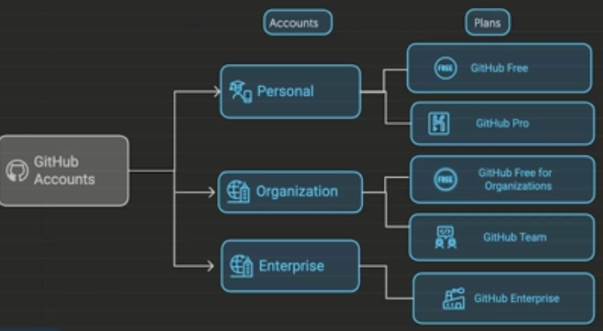
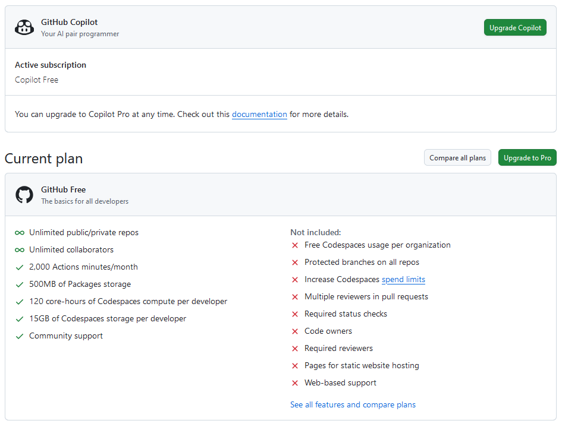

# Elementos del ecosistema de GitHub

Instructor: Luis Beltrán

GitHub es una plataforma de desarrollo colaborativo que permite a los desarrolladores trabajar juntos en proyectos de software. A continuación, se describen algunos de los elementos clave del ecosistema de GitHub, basado en la nube.

## Plataforma de GitHub

- Powered by AI:
  - GitHub Copilot: Asistente de codificación basado en IA que sugiere líneas de código y funciones completas mientras escribes.
  - GitHub Copilot Chat: Interfaz de chat para interactuar con el asistente de codificación, permitiendo hacer preguntas y recibir sugerencias en tiempo real.
- Colaboración:
  - Pull Requests: Solicitudes para fusionar cambios en el código, permitiendo revisiones y discusiones antes de integrar los cambios.
  - Issues: Herramienta para rastrear errores, tareas y mejoras en el proyecto, facilitando la comunicación entre los colaboradores.
- Productividad:
  - GitHub Actions: Herramienta de automatización que permite crear flujos de trabajo para compilar, probar y desplegar aplicaciones automáticamente.
  - GitHub Projects: Herramienta de gestión de proyectos que permite organizar tareas y colaborar en el desarrollo de software.
- Seguridad:
  - Dependabot: Herramienta que ayuda a mantener las dependencias del proyecto actualizadas y seguras, alertando sobre vulnerabilidades.
  - GitHub Security Advisories: Permite a los mantenedores de proyectos publicar avisos de seguridad para informar a los usuarios sobre vulnerabilidades conocidas.
- Scale:
  - GitHub Enterprise: Versión de GitHub diseñada para grandes organizaciones, ofreciendo características avanzadas de seguridad, administración y soporte.
  - GitHub Marketplace: Plataforma para descubrir y comprar aplicaciones y herramientas que se integran con GitHub, mejorando la funcionalidad y la productividad.

## Cuenta de GitHub

- **Cuenta gratuita**: Permite crear repositorios públicos y privados, colaborar en proyectos de código abierto y acceder a herramientas básicas.
- **Cuenta Pro**: Ofrece características adicionales como repositorios privados ilimitados, estadísticas avanzadas y soporte prioritario.
- **Cuenta Team**: Diseñada para equipos, incluye herramientas de colaboración avanzadas, gestión de permisos y soporte para GitHub Actions.
- **Cuenta Enterprise**: Orientada a grandes organizaciones, proporciona características avanzadas de seguridad, administración y soporte personalizado.
- **Cuenta Education**: Ofrecida a estudiantes y educadores, incluye acceso a herramientas premium y recursos educativos para aprender y enseñar desarrollo de software.
- **Cuenta Open Source**: Diseñada para proyectos de código abierto, permite a los mantenedores acceder a herramientas premium y recursos para mejorar la visibilidad y el desarrollo de sus proyectos.
- **Cuenta Student Developer Pack**: Ofrecida a estudiantes, incluye acceso a herramientas y servicios premium de GitHub y otros proveedores, facilitando el aprendizaje y desarrollo de proyectos.
- **Cuenta GitHub Sponsors**: Permite a los desarrolladores recibir apoyo financiero de la comunidad para sus proyectos de código abierto, facilitando la sostenibilidad y el crecimiento de estos proyectos.
- **Cuenta GitHub Actions**: Proporciona acceso a la herramienta de automatización de flujos de trabajo, permitiendo a los desarrolladores crear, probar y desplegar aplicaciones de manera eficiente.
- **Cuenta GitHub Pages**: Permite a los usuarios alojar sitios web estáticos directamente desde sus repositorios, facilitando la creación y publicación de documentación, blogs y portafolios.
- **Cuenta GitHub Copilot**: Ofrece acceso al asistente de codificación basado en IA, que sugiere líneas de código y funciones completas mientras se escribe, mejorando la productividad y la calidad del código.
- **Cuenta GitHub Copilot Chat**: Proporciona una interfaz de chat para interactuar con el asistente de codificación, permitiendo hacer preguntas y recibir sugerencias en tiempo real, mejorando la experiencia de desarrollo.
- **Cuenta GitHub Actions Marketplace**: Permite a los usuarios descubrir y comprar aplicaciones y herramientas que se integran con GitHub Actions, mejorando la funcionalidad y la productividad de los flujos de trabajo de automatización.
- **Cuenta GitHub Security**: Ofrece herramientas y recursos para mejorar la seguridad de los proyectos, incluyendo Dependabot, GitHub Security Advisories y análisis de vulnerabilidades, ayudando a los desarrolladores a mantener sus aplicaciones seguras.
- **Cuenta GitHub Projects**: Proporciona herramientas de gestión de proyectos para organizar tareas, colaborar en el desarrollo de software y mejorar la productividad del equipo.
- **Cuenta GitHub Marketplace**: Permite a los usuarios descubrir y comprar aplicaciones y herramientas que se integran con GitHub, mejorando la funcionalidad y la productividad de la plataforma.
- **Cuenta GitHub Enterprise Cloud**: Versión de GitHub diseñada para grandes organizaciones, ofreciendo características avanzadas de seguridad, administración y soporte personalizado en la nube.
- **Cuenta GitHub Enterprise Server**: Versión de GitHub diseñada para grandes organizaciones que prefieren alojar sus repositorios en sus propios servidores, ofreciendo características avanzadas de seguridad y administración.
- **Cuenta GitHub Actions for Enterprise**: Proporciona acceso a la herramienta de automatización de flujos de trabajo para grandes organizaciones, permitiendo crear, probar y desplegar aplicaciones de manera eficiente y segura.
- **Cuenta GitHub Sponsors for Open Source**: Permite a los mantenedores de proyectos de código abierto recibir apoyo financiero de la comunidad, facilitando la sostenibilidad y el crecimiento de estos proyectos.

1. Crear una cuenta, cuentas individuales gratuita.
2. Configurar la cuenta, se recomienda siempre activar la doble autenticación 2FA. Se puede usar una aplicación de autenticación como Google Authenticator o Authy, o recibir códigos por SMS.
3. Personalizar la cuenta

## Diferencias entre Git y GitHub

- **Git**: Es un sistema de control de versiones distribuido que permite a los desarrolladores rastrear cambios en el código fuente a lo largo del tiempo. Git se centra en la gestión de versiones y la colaboración en proyectos de software.
- **GitHub**: Es una plataforma basada en la nube que utiliza Git como sistema de control de versiones. GitHub proporciona una interfaz web para gestionar repositorios, colaborar en proyectos, realizar revisiones de código y automatizar flujos de trabajo. Además, ofrece características adicionales como GitHub Actions, Issues y Pull Requests para mejorar la colaboración y la productividad.

| Item      | Git       | GitHub    |
| --------- | --------- | --------- |
|  1        | Es un software           | Es un servicio           |
|  2        | Se instala en local          | Esta hospedado en la web          |
|  3         | herramienta de linea de comandos          | Tiene una interface grafica          |
|  4         | Es una herramienta para administrar diferentes versiones de un repositorio          | Es un espacio donde se alojan copias de repositorios git          |
|  5         | Provee funcionalidades para el control de versiones          | Provee las funcionalidades de git + otras características           |

## Tipos de cuentas de GitHub

| Tipo de cuenta | Descripción |
| -------------- | ----------- |
| Cuenta Personal | Permite crear repositorios públicos y privados, colaborar en proyectos de código abierto y acceder a herramientas básicas. |
| Cuenta Organizacional | Ofrece características adicionales como repositorios privados ilimitados, estadísticas avanzadas y soporte prioritario. |
| Cuenta Empresarial | Diseñada para equipos, incluye herramientas de colaboración avanzadas, gestión de permisos y soporte para GitHub Actions. server y cloud |

### Cuentas personal

- **Cuenta gratuita**: Permite crear repositorios públicos y privados, colaborar en proyectos de código abierto y acceder a herramientas básicas.
- Posee recursos como repositorios, paquetes y proyectos.
- se administra de manera sencilla a propietarios y colaboradores.
- Toda accion se atribuye a la cuenta personal.
- Licencias github free o github pro.

### Cuentas organizacionales

- Cuenta compartida para colaborar en varios proyectos.
- permisos gestionados por niveles (roles)
- Una organización posee recursos como repositorios, paquetes y proyectos.
- No se inicia sesión en una organización, se inicia sesión en una cuenta personal y se accede a la organización.
- Toda acción se atribuye a la cuenta personal del usuario.
- Solo el propietario de la organización y administrador se seguridad puede gestionar la configuración y controlar el acceso a los datos de la organización de manera granular.

#### Roles

| Rol | Descripción |
| --- | ----------- |
| Propietario de la organización  | Tiene control total sobre la organización, incluyendo la gestión de miembros, repositorios y configuración de seguridad. |
| Administrador de seguridad | Responsable de la seguridad de la organización, puede gestionar políticas de seguridad y acceso a los datos. |
| Miembro de la organización | Tiene acceso a los repositorios y recursos de la organización, pero no puede gestionar la configuración ni los miembros. |
| Moderador de la organización |  |
| Administrador de billing o cobros, facturación |  |
| Administrador de seguridad |  |
| Github app administrador |  |
| Outside colaborador o externo |  |

## Cuenta Empresa o enterprise

- Los administradores de cuentas empresariales gestionan de forma centralizada politicas y facturación para varias organizaciones.
- Los propietarios de una cuenta de empresa pueden invitar a organizaciones a unirse a la cuenta, transferir organizaciones entre cuentas de empresa o crear nuevas organizaciones.

## Visibilidad de los repositorios

hay 3 tipos de visibilidad de los repositorios en GitHub:

| Visibilidad | Descripción |
| ----------- | ----------- |
| Público      | Repositorio accesible para cualquier persona en GitHub, ideal para proyectos de código abierto. |
| Privado      | Repositorio accesible solo para los colaboradores autorizados, ideal para proyectos privados o confidenciales. |
| Interno      | Solo disponibles en cuentas empresariales |

## Planes de GitHub

| Plan | Descripción |
| ---- | ----------- |
| GitHub Free | Plan gratuito que permite crear repositorios públicos y privados, colaborar en proyectos de código abierto y acceder a herramientas básicas. |
| GitHub Pro | Plan de pago que ofrece características adicionales como repositorios privados ilimitados, estadísticas avanzadas y soporte prioritario. |
| GitHub Team | Plan diseñado para equipos, incluye herramientas de colaboración avanzadas, gestión de permisos y soporte para GitHub Actions. |
| GitHub Enterprise | Plan orientado a grandes organizaciones, proporciona características avanzadas de seguridad, administración y soporte personalizado. |

### GitHub Free para cuentas personales en 2025

- Permite crear repositorios públicos y privados.
- Numero ilimitado de colaboradores.
- Soporte técnico de la comunidad.
- Alertas de dependabot.
- Aplicación de la autenticación de dos factores.
- 500 MB de almacenamiento para GitHub Packages.
- 120 horas de github codespaces al mes.
- 15 GB de almacenamiento de githun codespaces al mes.
- 2,000 minutos de GitHub Actions al mes.
- reglas de protección de implementación para repositorios publicos

se ve en settings -> plan y facturación

### Github Free para Organizaciones en 2025

- Además de las características de la cuenta personal se incluyen:
- Controles de acceso al equipo para administrar los grupos.
- Colaboradores ilimitados en repositorios públicos ilimitados con un conjunto completo de características.
- Repositorios privados ilimitados con un conjunto completo de características ilimitado.

### GitHub Pro para cuentas personales en 2025

- Todo lo incluido en GitHub Free.
- Repositorios privados ilimitados con un conjunto completo de características.
- Soporte técnico prioritario.
- 3,000 minutos de GitHub Actions al mes.
- 2 GB de almacenamiento para GitHub Packages.
- 180 horas de GitHub Codespaces al mes.
- 20 GB de almacenamiento para GitHub Codespaces al mes.
- Herramientas avanzadas e información en repositorios privados
  - Necesidad de revisores de solicitudes de incorporación de cambios.
  - Varios revisores de solicitudes de incorporación de cambios.
  - Ramas protegidas.
  - Propietarios del código.
  - Referencias de vinculos automáticas.
  - Github Pages
  - Wikis

### Github Team para organizaciones en 2025

- Todo lo incluido en GitHub Pro.
- Soporte técnico por correo electrónico.
- 3000 minutos de GitHub Actions al mes.
- 2 GB de almacenamiento para GitHub Packages.
- Herramientas avanzadas e información en repositorios privados.
  - Necesidad de revisores de solicitudes de incorporación de cambios.
  - Varios revisores de solicitudes de incorporación de cambios.
  - Ramas protegidas.
  - Borrador draft de PRs
  - Revisores de PRs en equipo.
  - Propietarios del código.
  - Avisos programados.
  - GitHub Pages.
  - Wikis.
- Gráficos de información del repositorio para pulso, colaboradores, contribuciones y dependencias, bifurcaciones y solicitudes de incorporación de cambios.
- La opción de habilitar o deshabilitar github codespaces.

### GitHub Enterprise para organizaciones en 2025

- Todo lo incluido en GitHub Team.
- Soporte técnico
- Mas controles de seguridad, cumplimiento e implementación.
- Autenticación con SAML SSO.
- Aprovisionamiento del acceso con SAML SSO SCIM.
- Reglas de protección de implementación con github actions para repositorios privados o internos de github connect.
- La opción de comprar GitHub Advanced Security para repositorios privados o internos de GitHub Connect.
- Github enterprise managed users

#### GitHub Server GHES

- Permite a las organizaciones alojar sus repositorios en sus propios servidores.
- Ofrece características avanzadas de seguridad y administración.
- Permite la integración con herramientas y servicios existentes en la infraestructura de la organización.

#### GitHub Cloud GHEC

- Versión de GitHub alojada en la nube, diseñada para grandes organizaciones.
- Ofrece características avanzadas de seguridad, administración y soporte personalizado.
- Incluye las capacidades de GHES mas:
  - 50000 minutos de GitHub Actions al mes.
  - 50 GB de almacenamiento para GitHub Packages.
  - Un SLA de 99.9% de disponibilidad.
  - Administración de forma centralizada de políticas y facturación para varias organizaciones.
  - Enterprise Managed Users (EMUs) para gestionar usuarios y permisos de manera centralizada.

para validar la disponibilidad de los servicios de GitHub, puedes visitar la página de estado de GitHub: [GitHub Status](https://www.githubstatus.com/).

## GitHub Mobile

GitHub Mobile es una aplicación para dispositivos móviles que permite a los usuarios interactuar con sus repositorios y colaborar en proyectos desde sus teléfonos inteligentes o tabletas. Algunas de las características clave de GitHub Mobile incluyen:

## GitHub Desktop

GitHub Desktop es una aplicación de escritorio que permite a los usuarios gestionar sus repositorios de GitHub de manera más sencilla y visual. Algunas de las características clave de GitHub Desktop incluyen:

## GitHub CLI

GitHub CLI (Command Line Interface) es una herramienta de línea de comandos que permite a los usuarios interactuar con GitHub directamente desde la terminal. Algunas de las características clave de GitHub CLI incluyen:

- **Interacción con GitHub**: Permite realizar operaciones comunes de GitHub, como crear y gestionar repositorios, issues, pull requests y más, directamente desde la línea de comandos.
- **Integración con Git**: Se integra con Git, lo que permite realizar operaciones de control de versiones y colaboración sin necesidad de cambiar de herramienta.
- **Automatización de tareas**: Permite automatizar tareas comunes de GitHub mediante scripts, facilitando la integración en flujos de trabajo personalizados.
- **Compatibilidad multiplataforma**: Disponible para Windows, macOS y Linux, lo que permite a los usuarios trabajar en sus proyectos desde diferentes sistemas operativos.
- **Interfaz intuitiva**: Ofrece una interfaz de línea de comandos fácil de usar, con comandos intuitivos y opciones de autocompletado para facilitar la navegación y la ejecución de tareas.
- **Acceso a características avanzadas**: Permite acceder a características avanzadas de GitHub, como la gestión de acciones, la creación de releases y la administración de organizaciones, directamente desde la terminal.
- **Documentación y soporte**: Incluye documentación integrada y soporte para comandos, lo que facilita la comprensión y el uso de la herramienta.
- **Integración con GitHub Actions**: Permite gestionar flujos de trabajo de automatización y CI/CD directamente desde la línea de comandos, facilitando la implementación y el despliegue de aplicaciones.
- **Personalización**: Permite personalizar la configuración y los comandos según las necesidades del usuario, lo que facilita la adaptación a diferentes flujos de trabajo y preferencias.
