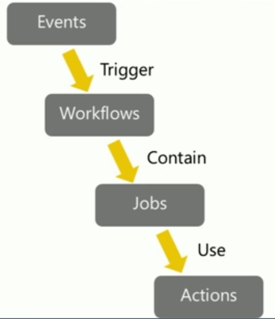
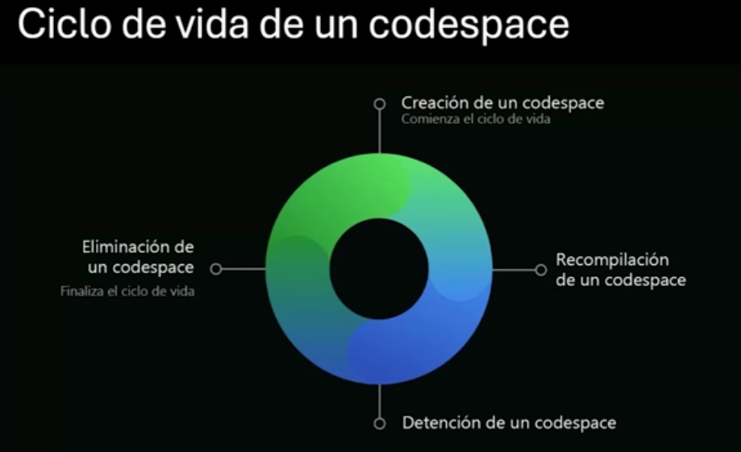

# Desarrollo moderno con GitHub

Instructor: Luis Beltran

1. GitHub Actions
2. GitHub Copilot
3. GitHub Codespaces

## GitHub Actions

GitHub Actions es una herramienta de automatización de flujos de trabajo que permite a los desarrolladores crear, probar y desplegar su código directamente desde GitHub. Permite definir acciones que se ejecutan en respuesta a eventos específicos, como la creación de un Pull Request o la fusión de un commit.



- Uso principal en crear soluciones de integración continua (CI) y entrega continua (CD).

Otros usos:

- Pruebas automatizadas: Ejecutar pruebas unitarias y de integración automáticamente al realizar un commit o al abrir un Pull Request.
- Respuesta automatica a nuevos issues o menciones
- Desencadenar revisiones de código: Notificar a los revisores cuando se crea un Pull Request o se actualiza un issue.
- Control de PRs: Automatizar el proceso de revisión y fusión de Pull Requests, incluyendo la verificación de que se cumplan ciertos criterios antes de permitir la fusión.
  
```bash
carpeta/.github/workflows/ci.yml
name: CI
on:
  push:
    branches:
      - main
  pull_request:
    branches:
      - main
jobs:
  build:
    runs-on: ubuntu-latest
    steps:
      - name: Checkout code
        uses: actions/checkout@v2
      - name: Set up Node.js
        uses: actions/setup-node@v2
        with:
          node-version: '14'
      - name: Install dependencies
        run: npm install
      - name: Run tests
        run: npm test
```

Conceptos:

1. Workflow: Un conjunto de acciones que se ejecutan en respuesta a eventos específicos. Se define en un archivo YAML dentro del directorio `.github/workflows` del repositorio.
2. Evento: Un desencadenante que inicia la ejecución de un workflow. Puede ser un push, un pull request, un issue, entre otros.
3. Job: Una unidad de trabajo dentro de un workflow. Un workflow puede contener uno o más jobs, que se ejecutan en paralelo o secuencialmente.
4. Step: Una acción individual dentro de un job. Cada step puede ejecutar un comando, una acción predefinida o un script personalizado.
5. Action: Una acción es un paso reutilizable que puede ser compartido entre diferentes workflows. Puede ser una acción predefinida de GitHub o una acción personalizada creada por el usuario.
6. Runner: Un servidor que ejecuta los jobs de un workflow. GitHub proporciona runners hospedados, pero también se pueden configurar runners auto-hospedados.
7. Artifact: Un archivo o conjunto de archivos generados por un job que se pueden almacenar y utilizar en otros jobs o workflows. Los artifacts pueden incluir resultados de pruebas, binarios compilados, entre otros.
8. Secrets: Variables de entorno seguras que se pueden utilizar en los workflows para almacenar información sensible, como claves API o credenciales de acceso. Los secrets se configuran en la configuración del repositorio y no se exponen en los logs de ejecución.
9. Matrix builds: Una característica que permite ejecutar un job en múltiples configuraciones, como diferentes versiones de un lenguaje de programación o sistemas operativos. Esto es útil para probar la compatibilidad del código en diferentes entornos.
10. Cache: Una funcionalidad que permite almacenar dependencias y otros archivos generados por los jobs para acelerar las ejecuciones posteriores. El cache se puede utilizar para evitar la descarga repetida de dependencias o la recompilación de código.
11. Environment: Un entorno es una colección de variables de entorno y secretos que se pueden utilizar en los workflows. Los entornos permiten gestionar diferentes configuraciones para desarrollo, pruebas y producción.
12. Concurrency: Una característica que permite limitar el número de ejecuciones simultáneas de un workflow o job. Esto es útil para evitar conflictos en recursos compartidos o para controlar el uso de recursos en entornos de producción.

## GitHub Copilot

GitHub Copilot es una herramienta de inteligencia artificial que ayuda a los desarrolladores a escribir código más rápido y con mayor precisión. Utiliza modelos de lenguaje para sugerir líneas de código y completar funciones basadas en el contexto del código existente.

- Modo Ask
  - Permite a los desarrolladores hacer preguntas en lenguaje natural y recibir respuestas en forma de código.
  - Ideal para obtener ejemplos de código, resolver dudas sobre sintaxis o encontrar soluciones a problemas específicos.
  - Ejemplo: "¿Cómo puedo crear una función que calcule la suma de dos números en Python?"
- Modo Agent:
  - Permite a los desarrolladores interactuar con Copilot de manera más dinámica, como si fuera un asistente de programación.
  - Los desarrolladores pueden pedirle a Copilot que realice tareas específicas, como refactorizar código, agregar comentarios o generar pruebas unitarias.
  - Ejemplo: "Refactoriza esta función para que sea más eficiente" o "Agrega comentarios explicativos a este bloque de código".
- Modo Edit:
  - Permite a los desarrolladores editar el código existente con la ayuda de Copilot, que sugiere cambios y mejoras en tiempo real.
  - Ideal para realizar ajustes rápidos, corregir errores o mejorar la legibilidad del código.
  - Ejemplo: "Cambia el nombre de esta variable a 'total' y ajusta la lógica en consecuencia".

### Uso del contexto

GitHub Copilot utiliza el contexto del código existente para generar sugerencias relevantes. Esto significa que puede entender la estructura del código, las funciones definidas y las bibliotecas importadas para ofrecer recomendaciones más precisas.

Como indicar el contexto:

- Con # para agregar un archivo de contexto, carpeta o repositorio completo.
- Con @ para mencionar funciones, variables o clases específicas en el código.
- *Solo en la versión de pago enterprise* se pueden sacar del contexto archivos o excluir

## GitHub Codespaces

GitHub Codespaces es un entorno de desarrollo integrado (IDE) basado en la nube que permite a los desarrolladores trabajar en sus proyectos directamente desde el navegador. Proporciona un entorno preconfigurado con todas las herramientas necesarias para desarrollar, probar y depurar aplicaciones sin necesidad de configurar un entorno local.

- Desde plantillas
- Desde una rama
- Desde un PR abierto
- Desde un commit específico


